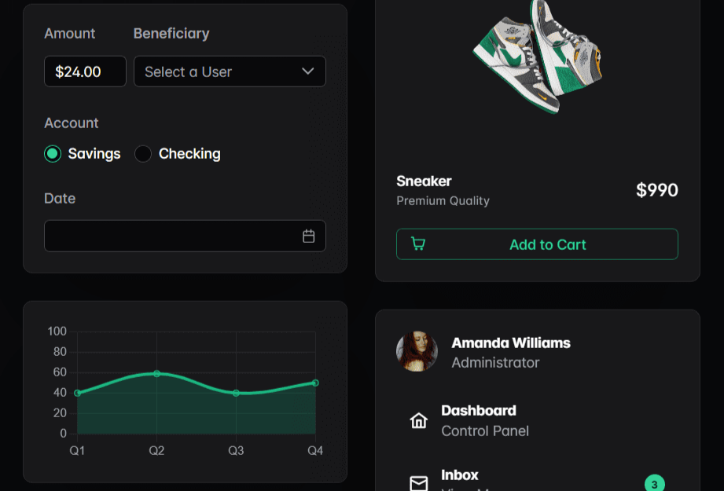
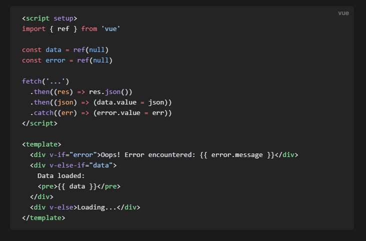

import { Card, CardGrid, LinkCard } from '@astrojs/starlight/components';
import { LinkButton } from '@astrojs/starlight/components';
import { Icon } from '@astrojs/starlight/components';

	<h1 class="text-[2.5rem]">Why Vue.js?</h1>

  <Card title="Approachable" icon="approve-check-circle" class="flex-1">
    Builds on top of standard HTML, CSS and JavaScript with intuitive API and world-class documentation.
  </Card>
  <Card title="Performant" icon="approve-check-circle" class="flex-1">
    Truly reactive, compiler-optimized rendering system that rarely requires manual optimization.
  </Card>
  <Card title="Versatile" icon="approve-check-circle" class="flex-1">
    A rich, incrementally adoptable ecosystem that scales between a library and a full-featured framework.
  </Card>

	<h1 class="text-[2.5rem]">Build with Vue.js</h1>

  

	
  

  <Card title="Components In-Depth" class="w-[50%]">
	Build reusable, modular UI elements with Vue components. 
	This section explores advanced patterns like props, slots, 
	custom events, and provides strategies for managing complex UIs efficiently.
	<LinkButton
		href="https://vuejs.org/guide/components"
		variant="secondary"
		icon="right-arrow"
		iconPlacement="end"
		>
		Explore
	</LinkButton>
  </Card>

  

	
  

  <Card title="Built-in Components">
    Explore Vue’s powerful built-in components like transition, keep-alive 
	and teleport, to solve common UI challenges. These tools help manage state, 
	animation, and DOM structure cleanly.
	<LinkButton
		href="https://vuejs.org/guide/built-ins/transition.html"
		variant="secondary"
		icon="right-arrow"
		iconPlacement="end"
		>
		Explore
	</LinkButton>
  </Card>

  

  
  

  <Card title="Reusability">
   Level up your app architecture by extracting and reusing logic through 
   composables, custom directives, and plugins. Discover how to write clean, 
   maintainable code across your Vue application.
   <LinkButton
		href="https://vuejs.org/guide/reusability/composables.html"
		variant="secondary"
		icon="right-arrow"
		iconPlacement="end"
		>
		Explore
	</LinkButton>
  </Card>

	

		

			<h1>Explore other Vue.js capabilities</h1>
			

			Explore other powerful capabilities of Vue.js, 
			including accessibility, security, and performance best 
			practices to build inclusive, safe, and efficient applications. 
			Dive into the glossary for quick concept references and follow 
			industry-standard practices to elevate your development workflow.
			

		

		<CardGrid>
			<Card title="Scaling Up" icon="approve-check-circle">
				Design your Vue app to scale seamlessly.
				 <LinkButton
					href="https://vuejs.org/guide/reusability/composables.html"
					variant="secondary"
					icon="right-arrow"
					iconPlacement="end"
					>
					Explore
				</LinkButton>
			</Card>
			<Card title="Best Practices" icon="approve-check-circle">
				Follow established patterns and conventions to write clean, maintainable Vue code.
				<LinkButton
					href="https://vuejs.org/guide/reusability/composables.html"
					variant="secondary"
					icon="right-arrow"
					iconPlacement="end"
					>
					Explore
				</LinkButton>			
			</Card>
			<Card title="Typescript" icon="approve-check-circle">
				Combine the flexibility of Vue with the safety of TypeScript.
				<LinkButton
					href="https://vuejs.org/guide/reusability/composables.html"
					variant="secondary"
					icon="right-arrow"
					iconPlacement="end"
					>
					Explore
				</LinkButton>			
			</Card>
			<Card title="Extra Topics" icon="approve-check-circle">
				Enhance your development workflow with Vue’s ecosystem tools. 
				<LinkButton
					href="https://vuejs.org/guide/reusability/composables.html"
					variant="secondary"
					icon="right-arrow"
					iconPlacement="end"
					>
					Explore
				</LinkButton>	
			</Card>
		</CardGrid>
	

	

		

			<h4 class="mb-[1em]">About</h4>
			<a href="" class="no-underline">FAQ</a>
			<a href="" class="no-underline">Team</a>
			<a href="" class="no-underline">Releases</a>
			<a href="" class="no-underline">Community Guide</a>
			<a href="" class="no-underline">Privacy Policy</a>
		

		

			<h4 class="mb-[1em]">Learn Vue</h4>
			<a href="" class="no-underline">Guide</a>
			<a href="" class="no-underline">Tutorial</a>
			<a href="" class="no-underline">Examples</a>
			<a href="" class="no-underline">References</a>
			<a href="" class="no-underline">Glossary</a>
			

		

			<h4 class="mb-[1em]">Resources</h4>
			<a href="" class="no-underline">Partners</a>
			<a href="" class="no-underline">Developers</a>
			<a href="" class="no-underline">Themes</a>
			<a href="" class="no-underline">UI Components</a>
			<a href="" class="no-underline">Jobs</a>
		

		

			<h4 class="mb-[1em]">Community</h4>
			<a href="" class="no-underline">DEV Community</a>
			<a href="" class="no-underline">GitHub Discussions</a>
			<a href="" class="no-underline">Discord Chat</a>
			<a href="" class="no-underline">Blog</a>
			<a href="" class="no-underline">Newsletters</a>
		

		

			<a href="" class="no-underline"><Icon name="x.com" size="2rem" /></a>
			<a href="" class="no-underline"><Icon name="github" size="2rem" /></a>
			<a href="" class="no-underline"><Icon name="discord" size="2rem" /></a>
		

	

